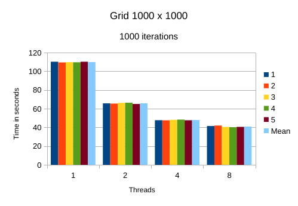

# Wa-Tor-Simulation

A GO simulation of the Wa-Tor world.

### Before running or compiling the program make sure that [Fyne](https://docs.fyne.io/started/) is set up correctly.

To run the simulation type in the following to a terminal in the **source** directory:

`go run .`

To build and run executable:

`go build . && ./source`

To view documentation do one of the following steps:

1. Open up the **documentation** directory in a HTML server such as VS Code Live Server.

2. Install the [Golds](https://github.com/go101/golds) package using:

   `go install go101.org/golds@latest`

   Then change to the **source** directory and run:

   `golds .`

   If you get an error saying `golds` cannot be found it means that the Go binary installation path is not in the `PATH` environment variable. In that case either add it or run from where it is installed, usually:

   `~/go/bin/golds .`

Following one of the above 2 steps a web browser should then open on the `index.html` page. Sort by **dependancy distance** and select the first one to read the documentation of the code i.e. **github.com/NotYetTerminal/Wa-Tor-Simulation/source**

## Benchmarking Results

All simulations were run for 1000 iterations, the variables of the simulation were set as following to ensure that a stable ecosystem was being simulated:

- Number of sharks: 200
- Number of fish: 400
- Fish breeding time: 10
- Shark breeding time: 60
- Shark starvation time: 40
- Gid size and thread amount was varied.

Raw results are able to be viewed in the [ODS File](statistics.ods).

- For a grid of size 100 by 100 the following mean times were obtained for each thread:

  - 1: 0.5476
  - 2: 0.432
  - 4: 0.3318
  - 8: 0.258

  _Graph for grid size of 100 by 100:_  
   

- For a grid of size 200 by 200 the following mean times were obtained for each thread:

  - 1: 2.208
  - 2: 1.5134
  - 4: 1.0912
  - 8: 0.8138

  _Graph for grid size of 200 by 200:_  
   

- For a grid of size 500 by 500 the following mean times were obtained for each thread:

  - 1: 19.9934
  - 2: 11.9994
  - 4: 9.1594
  - 8: 6.2666

  _Graph for grid size of 500 by 500:_  
   

- For a grid of size 1000 by 1000 the following mean times were obtained for each thread:

  - 1: 109.8152
  - 2: 65.7602
  - 4: 47.869
  - 8: 40.9434

  _Graph for grid size of 1000 by 1000:_  
   

# LICENCE

All files not declared with a license are under the following license:  
Concurrent-Development © 2024 by Gábor Major is licensed under CC BY-NC-SA 4.0. To view a copy of this license,
visit https://creativecommons.org/licenses/by-nc-sa/4.0/
